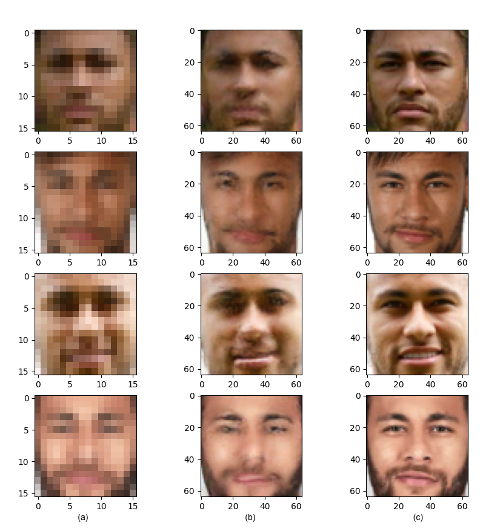

#  Photo-Realistic Single Image Super-Resolution Using a Generative Adversarial Network

## Overview

An unofficial implementation of SRGAN described in the paper using PyTorch.
* [ Photo-Realistic Single Image Super-Resolution Using a Generative Adversarial Network](https://arxiv.org/abs/1609.04802)

Published in CVPR 2017

## Requirement
- Python 3.6.5
- PyTorch 1.1.0 
- Pillow 5.1.0
- numpy 1.14.5
- scikit-image 0.15.0

## Datasets
- [DIV2K](https://data.vision.ee.ethz.ch/cvl/DIV2K/)

## Pre-trained model
- [SRResNet](https://drive.google.com/open?id=15F2zOrOg2hIjdI0WsrOwF1y8REOkmmm0)


- [SRGAN](https://drive.google.com/open?id=1-HmcV5X94u411HRa-KEMcGhAO1OXAjAc)

## Train & Test
Train 

```
python main.py --LR_path ./LR_imgs_dir --GT_path ./GT_imgs_dir
```

Test

```
python main.py --mode test --LR_path ./LR_imgs_dir --GT_path ./GT_imgs_dir --generator_path ./model/SRGAN.pt
```

Inference your own images

```
python main.py --mode test_only --LR_path ./LR_imgs_dir --generator_path ./model/SRGAN.pt
```

## Experimental Results
To achieve a super-resolution results consistent with the one shown below, crop faces accordingly.

